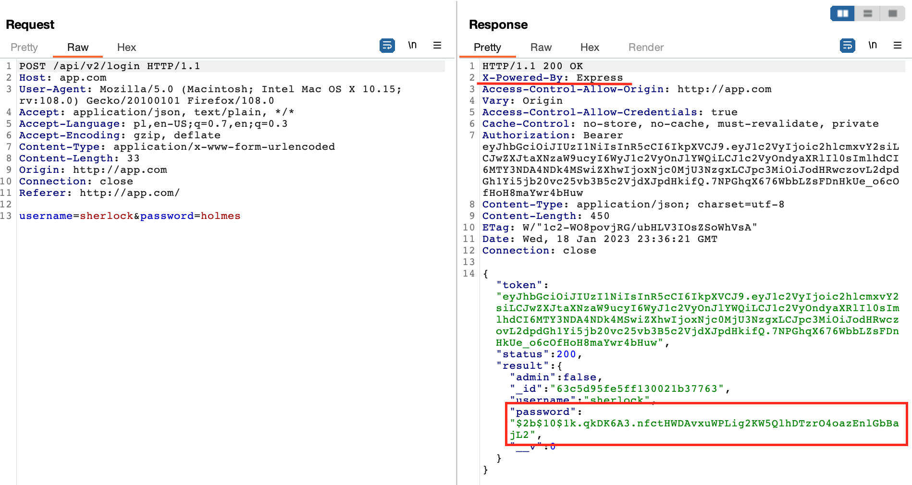
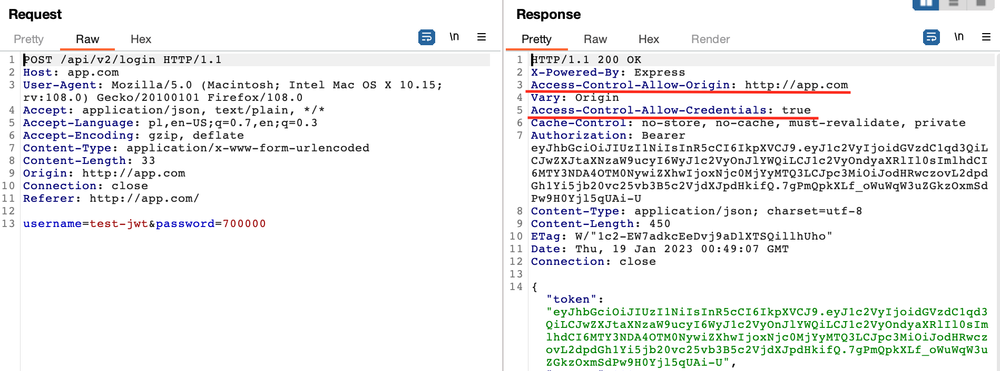

# Damn Vulnerable Web Services

## Aplikacja
Aplikacja Damn Vulnerable Web Services to podatna na ataki usługa internetowa i interfejs API, której można użyć do poznania luk w zabezpieczeniach związanych z usługami sieciowymi/API.
Instalacja aplikacji przebiega za pomocą dockera. Wystarczy wywołać polecenie:
```
`docker-compose up`
```
Na koniec nalezy w pliku /etc/hosts podmienić nazwę localhost dla adresu 127.0.0.1 na wybraną nazwę aplikacji.

Aplikacja webowa została napisana w JavaScript.
Funkcjonalności aplikacji pozwalają na tworzenie użytkowników, którzy mogą stworzyć oraz modyfikować  notatki, przypomnienia oraz wygenerować hasła. Aplikacja umożliwia także przechowywanie plików. Wyróżnia się funkcjonalności dla zwykłego użytkownika oraz admina.

## WERSJE OPROGRAMOWANIA

Tested on:
* node v10.19.0
* npm 6.13.7
* mongodb 4.0.4
* mysql  4.0.4
* docker 20.10.22
* docker- compose 2.9.0

# Podsumowanie aka audyt
Audyt aplikacji Damn Vulnerable Web Service został zrealizowany zgodnie z OWASP TOP 10 oraz pod kątem ogólnego bezpieczeństwa aplikacji. Do testowania aplikacji wykorzystano program burp suite.

Wyróżniono kilka głównych problemów wpływających na niezgodność aplikacji z wymaganiami standardu:
1. Brak formalnej dokumentacji świadczącej o analizie bezpieczeństwa aplikacji, w tym:
    * brak architektury bezpieczeństwa wraz z wyróżnieniem obszarów zaufania i przepływów danych,
2. Niewystarczająco zabezpieczony mechanizm wysyłania plików przez użytkowników.

Badana aplikacja wykazała wiele podatności na ataki, więc przed udostępnieniem jej szerzej nalezałoby ją odpowiedno zabezpieczyć. Aplikacja ma bardzo niski poziom zabezpieczeń, skupiający się głównie na szyfrowaniu haseł uzytkownika. Dane uzytkownika nie są w zadnym stopniu chronione.

## TESTY ZABEZPIECZEŃ

### 1. Hashowanie haseł

Hasła są zaszyfrowane


### 2. XML External Entity Injection (XXE)

Wstrzyknięcie podmiotu zewnętrznego XML (znane również jako XXE) to luka w zabezpieczeniach sieci Web, która umożliwia osobie atakującej ingerowanie w przetwarzanie danych XML przez aplikację. Często umożliwia atakującemu przeglądanie plików w systemie plików serwera aplikacji i interakcję z dowolnymi systemami zaplecza lub systemami zewnętrznymi, do których sama aplikacja ma dostęp.
Biblioteka XML używana przez serwer SOAP do analizowania tego żądania umożliwia korzystanie z jednostek zewnętrznych. W związku z tym można to wykorzystać do odczytu dowolnych plików z usługi SOAP.


### 3. Server Side Request Forgery (SSRF)

Atak Server-Side Request Forgery (SSRF) polega na tym, że osoba atakująca nadużywa funkcjonalności serwera w celu uzyskania dostępu do zasobów lub ich modyfikacji. Celem atakującego jest aplikacja obsługująca import danych z adresów URL lub umożliwiająca odczytywanie danych z adresów URL. Adresami URL można manipulować, zastępując je nowymi lub modyfikując przechodzenie przez ścieżkę URL.

Zazwyczaj osoby atakujące dostarczają adres URL (lub modyfikują istniejący), a kod działający na serwerze odczytuje lub przesyła do niego dane. Atakujący mogą wykorzystać adresy URL, aby uzyskać dostęp do wewnętrznych danych i usług, które nie miały być ujawnione — w tym baz danych obsługujących protokół HTTP i danych konfiguracyjnych serwera.

Gdy atakujący zmanipuluje żądanie, serwer je otrzyma i spróbuje odczytać dane pod zmienionym adresem URL. Nawet w przypadku usług, które nie są bezpośrednio widoczne w publicznym Internecie, osoby atakujące mogą wybrać docelowy adres URL, który umożliwi im odczytanie danych.


### 4. User Enumeration
Atak user enumeration to typowa luka w zabezpieczeniach aplikacji, która pojawia się, gdy osoba atakująca może określić, czy nazwy użytkowników są prawidłowe, czy nie. Najczęściej ten problem występuje w formularzach logowania, gdzie zwracany jest błąd podobny do „nieprawidłowa nazwa użytkownika”.

Osoba atakująca może wykorzystać to zachowanie, używając długich list typowych nazw użytkowników, znanych nazw i słów ze słownika, aby obserwować reakcję aplikacji na wszystkie. Na podstawie tych wyników osoba atakująca może następnie wywnioskować, które nazwy użytkowników są prawidłowe.

* tworze uzytkownika
    

* sprawdzam jaka jest odpowiedź serwera gdy on istnieje
    

* sprawdzenie uzytkownika moze odbywac sie tez za pomoca xml
    

mając taką odpowiedź, hacker moze teraz za pomocą techniki brute force sforsować hasło uytkownika

### 5. NoSQL Injection - pozyskanie danych za pomocą zapytania do bazy
Wstrzyknięcie NoSQL to luka w zabezpieczeniach aplikacji internetowej korzystającej z bazy danych NoSQL. NoSQL (nie tylko SQL) odnosi się do systemów baz danych, które używają bardziej elastycznych formatów danych i nie obsługują języka SQL (Structured Query Language). Zazwyczaj przechowują dane i zarządzają nimi jako pary klucz-wartość, dokumenty lub wykresy danych.

Wstrzyknięcie NoSQL, podobnie jak wstrzyknięcie SQL, może pozwolić atakującym na ominięcie uwierzytelniania, eksfiltrację poufnych danych, manipulowanie danymi w bazie danych, a nawet naruszenie bezpieczeństwa bazy danych i serwera bazowego. Większość luk w zabezpieczeniach związanych z iniekcją NoSQL występuje, ponieważ programiści akceptują i przetwarzają dane wejściowe użytkownika bez ich odpowiedniego oczyszczenia.

Bazy danych NoSQL nie obsługują jednego standardowego języka zapytań, dlatego dokładne dozwolone zapytania zależą od:

 * Silnik bazy danych — na przykład MongoDB, Cassandra, Redis lub Google Bigtable
 * Język programowania — na przykład Python, PHP
 * Ramy programistyczne — na przykład Angular, Node.js

Wspólnym mianownikiem większości baz danych NoSQL jest to, że obsługują one tekstowy format JavaScript Object Notation (JSON) i zazwyczaj umożliwiają wprowadzanie danych przez użytkownika za pośrednictwem plików JSON. Jeśli te dane wejściowe nie zostaną oczyszczone, mogą być podatne na ataki iniekcyjne.

Dzięki temu mozna było pozyskać wszystkie dostępne notatki, nawet te, które nie są publiczne.


### 6. Insecure Direct Object Reference

Niezabezpieczone bezpośrednie odniesienia do obiektów (IDOR) to rodzaj luki w zabezpieczeniach kontroli dostępu, która powstaje, gdy aplikacja używa danych wejściowych dostarczonych przez użytkownika w celu bezpośredniego dostępu do obiektów. Termin IDOR został spopularyzowany dzięki pojawieniu się w pierwszej dziesiątce rankingu OWASP 2007. Jest to jednak tylko jeden przykład wielu błędów implementacji kontroli dostępu, które mogą prowadzić do obchodzenia kontroli dostępu. Luki IDOR są najczęściej związane z poziomą eskalacją uprawnień, ale mogą również powstać w związku z pionową eskalacją uprawnień.


### 7. Mass Assignment

Atak polega na przypisywaniu wartości zmiennej po stronie serwera.
Przykłądem jest tworzenie użytkownika bez uprawnień adminstratora. 
W tym przypadku defaultowy obiekt użytkownika zostaje utworzony ze zmienną admin=false.
Atak będzie polegał na narzuceniu zmiennej admin=true i jednoczesnym przejęciu uprawnień administratora.


### 8. XML Cross-Site Scripting (XSS)

Cross-site scripting (znany również jako XSS) to luka w zabezpieczeniach internetowych, która umożliwia atakującemu naruszenie interakcji użytkowników z podatną aplikacją. Umożliwia atakującemu obejście tej samej zasady pochodzenia, która ma na celu oddzielenie różnych witryn internetowych od siebie. Luki w zabezpieczeniach związane z atakami typu cross-site scripting zwykle umożliwiają atakującemu podszywanie się pod użytkownika będącego ofiarą, wykonywanie wszelkich czynności, które użytkownik jest w stanie wykonać, oraz uzyskiwanie dostępu do dowolnych danych użytkownika. Jeśli użytkownik będący ofiarą ma uprzywilejowany dostęp do aplikacji, osoba atakująca może uzyskać pełną kontrolę nad wszystkimi funkcjami i danymi aplikacji.

Cross-site scripting polega na manipulowaniu podatną na ataki witryną internetową, tak aby zwracała użytkownikom szkodliwy kod JavaScript. Kiedy złośliwy kod jest wykonywany w przeglądarce ofiary, atakujący może całkowicie zagrozić swojej interakcji z aplikacją.

Istnieją trzy główne typy ataków XSS. To są:

* Reflected XSS, w którym złośliwy skrypt pochodzi z bieżącego żądania HTTP.
* Stored XSS, skąd złośliwy skrypt pochodzi z bazy danych serwisu.
* DOM-based XSS, gdzie luka występuje w kodzie po stronie klienta, a nie w kodzie po stronie serwera.


### 9. Hidden API Functionality Exposure
Nadmierna ekspozycja danych jest trzecim najbardziej krytycznym zagrożeniem bezpieczeństwa API w zestawieniu OWASP API Security Top 10. Występuje, gdy interfejs API odpowiada dodatkowymi danymi, które klient powinien przefiltrować lub zignorować. Jest to szczególnie niekorzystne, gdy dodatkowe dane zawierają elementy wrażliwe lub objęte wymogiem regulacyjnym.

Podczas tworzenia oprogramowania API można przyjąć dwa niefortunne założenia. Po pierwsze, programista może założyć, że tylko klienci firmy będą rozmawiać z interfejsem API i sądzić, że klient zignoruje dodatkowe dane. Niestety, atakujący nie ograniczy się tylko do oficjalnego klienta i zdecydują się wykorzystać dodatkowe dane. Po drugie, programiści mogą używać funkcji programistycznych do automatycznego przekształcania wewnętrznych danych API w odpowiedzi API. 

Kontynuując przykład ze sprzedawcą internetowym, osoba atakująca używa narzędzi programowych, aby wyglądać na aplikację mobilną sprzedawcy. Ponieważ osoba atakująca kontroluje klienta, zobaczy wszystkie dane wysyłane w odpowiedzi interfejsu API, w tym dane, które mają zostać zignorowane lub przypadkowo dołączone. Atakujący może również przechwycić ruch między interfejsem API a klientem w pewnych okolicznościach, oddając pełną odpowiedź w posiadanie atakującego. Gdy atakujący zobaczy dodatkowe dane dla jednej odpowiedzi, wyśle dodatkowe żądania w celu dalszego „pozyskania” jak największej ilości danych z interfejsu API.

Chociaż pojedyncze żądanie z wrażliwymi danymi może nie stanowić problemu egzystencjalnego, te same założenia, które prowadzą do tej pojedynczej podatnej na ataki odpowiedzi, zostały prawdopodobnie zastosowane w całym interfejsie API i osoby atakujące o tym wiedzą. Po znalezieniu przypadku nadmiernego narażenia danych będzie poszukiwanych więcej we wszystkich dostępnych metodach interfejsu API. Podobnie jak żucie wody, mniejszy problem może doprowadzić do całkowitego naruszenia bezpieczeństwa danych.

Na koniec atakujący wykorzysta każdą wykrytą metodę API, która ma nadmierną ekspozycję na dane, i zautomatyzuje żądanie pobrania wszystkich możliwych wrażliwych danych z API. Ataki te są zautomatyzowane, a ponieważ wydają się mieć „normalne” reakcje, mogą być trudne do wykrycia bez monitorowania środowiska uruchomieniowego skoncentrowanego na interfejsie API. Poniżej przedstawiono atak wyżej opisamny atak.

Po uruchomieniu swaggera widać rózne dostępne endpointy. Wpisując w przeglądarkę po kolei każdy endpoint, sprawdzane jest, czy są on zabezpieczone.


### 10. SQL Injection
Ataki SQL Injection są niestety bardzo powszechne, a wynika to z dwóch czynników:
znaczne rozpowszechnienie luk SQL Injection oraz atrakcyjność celu (tj. baza danych zazwyczaj zawiera wszystkie interesujące/krytyczne dane dla Twojej aplikacji). Wstrzyknięcia SQL są wprowadzane, gdy twórcy oprogramowania tworzą dynamiczne zapytania do bazy danych zbudowane z konkatenacji łańcuchów, które obejmują dane wejściowe wprowadzone przez użytkownika. Może to zostać wykorzystane do przeglądania, modyfikowania lub usuwania danych aplikacji, co wcześniej nie było możliwe, lub do powodowania trwałych zmian w zawartości lub zachowaniu aplikacji.

Uniknięcie błędów iniekcji SQL jest proste. Deweloperzy muszą albo: 
* przestać pisać dynamiczne zapytania z konkatenacją łańcuchów;
i/lub
* zapobiegać wpływaniu danych wejściowych użytkownika, które zawierają złośliwy kod SQL, na logikę wykonywanego zapytania.

Poniżej przeprowadzono atak polegający na wstrzyknięciu w URL dodatkowego znaku ' po nazwie użytkownika.
Przed atakiem:


Atak:


Po ataku:


Kolejny atak polegał na podmienieniu nazwy użytkownika na frazę '1'='1


### 11. Information Disclosure

    Ujawnienie informacji, znane również jako wyciek informacji, ma miejsce, gdy witryna internetowa nieumyślnie ujawnia użytkownikom poufne informacje. W zależności od kontekstu strony internetowe mogą ujawnić potencjalnemu atakującemu wszelkiego rodzaju informacje, w tym: dane o innych użytkownikach, takie jak nazwy użytkowników.

    Zwrocono uwage, ze testowana aplikacja ujawnia dane odnosnie:
* zszyfrowanego hasla, które jest zwracane uzytkownikowi po zalogowaniu 
* wyswietlany jest zbedny naglowek x-powered informujący, ze Express jest w uzytku

    

### 12. Command Injection


Atak ten różni się od wstrzykiwania kodu tym, że wstrzyknięcie kodu umożliwia atakującemu dodanie własnego kodu, który jest następnie wykonywany przez aplikację. W Command Injection atakujący rozszerza domyślną funkcjonalność aplikacji, która wykonuje polecenia systemowe, bez konieczności wstrzykiwania kodu.


### 13. JSON Hijacking

Kradzież tych informacji jest możliwa z następujących powodów:

Dane są zwracane z typem zawartości Content-Type: application/json (nie określono zestawu znaków)
Dane są zwracane wewnątrz tablicy [].
Do wykonania powyższego żądania nie jest wymagane żadne uwierzytelnienie (problem z kontrolą dostępu)


### 14. Cross Origin Resource Sharing

CORS to mechanizm, który zapewnia mozliwość bezpiecznej wymiany danych pomiędzy stronami, które charakteryzuje inny Origin.
    
Istnieją dwa główne rodzaje błędnych konfiguracji CORS, które mogą narazić serwer WWW na ataki CORS:
 * Access-Control-Allow-Origin (ACAO): Umożliwia dwukierunkową komunikację z witrynami stron trzecich.  Błędna konfiguracja Access-Control-Allow-Origin (ACAO) może zostać wykorzystana do modyfikowania lub przekazywania poufnych danych, takich jak nazwy użytkowników i hasła.
 *Access-Control-Allow-Credentials (ACAC): Umożliwia stronom internetowym stron trzecich wykonywanie uprzywilejowanych działań, które powinien być w stanie wykonać tylko autentycznie uwierzytelniony użytkownik.  Przykładem może być zmiana hasła lub informacji kontaktowych.

 Dla badanej aplikacji zauwazono ze parametr ACAC ustawiony jest na true, przez co aplikacja jest narazona na ataki CORS. Po wysłaniu z innej strony ządania dostępu do zasobu mozna np uzyskac informacje o wygenerowanych hasłach uzytkownikow, które nie sa zabezpieczone (kazdy z zewnatrz moze je podejrzec wpisujac odpowiedni adres url).


### 15. JWT Secret Key Brute Force

Uzytkownikowi po zalogowaniu zwracany jest token jwt. Token ten mozna sprobowac rozszywrowac uzywajac roznych narzedzi jak np. jwt-cracker.


### 16. Vertical Access Control

Pionowa eskalacja uprawnień jest możliwa, jeśli klucz kontrolowany przez użytkownika jest w rzeczywistości  flagą wskazującą status administratora, umożliwiając atakującemu uzyskanie dostępu administracyjnego.

Wiele wywołań interfejsu API, które może wykonać tylko administrator w obszarze administracyjnym, może wywołać użytkownik bez uprawnień administratora.

Po zalogowaniu na zwykłego użytkownika, wchodzimy w panel z danymi dla admina. Rozpoczyna się sprawdzanie uprawnień:


Atak polega na podmienieniu URL:


Użytkownik bez uprawnień administratora uzyskał dostęp do panelu admina:


Sprawdzenie możliwość korzystania z panelu i wyszukanie innego użytkownika:


### 17. Horizontal Access Control

Pozioma eskalacja uprawnień umożliwia jednemu użytkownikownikowi przeglądać/modyfikować informacje innego użytkownika.
Możliwe jest przeglądanie haseł utworzonych przez użytkownika, jeśli znasz nazwę użytkownika lub jego ID.

Utworzenie rekordu danych dla użytkownika z uprawnieniami administratora.


Zalogowanie na zwykłego użytkownika Marcin oraz podmiana nazwy użytkownika na tego z uprawnieniami administratora.


Dostęp do passphare administratora :


### 18. Path Traversal

Path Traversal umożliwia atakującym przechodzenie przez system plików w celu uzyskania dostępu do plików lub katalogów znajdujących się poza katalogiem objętym ograniczeniami.
W obszarze przechowywania można przesyłać pliki, które są przechowywane w lokalnym systemie plików, a następnie można je pobrać za pomocą funkcji pobierania.

Tym żądaniem HTTP można manipulować w celu odczytania dowolnych plików z systemu. Atak polega na podmianie nazwy i ścieżki pliku, który ma zostać pobrany.


