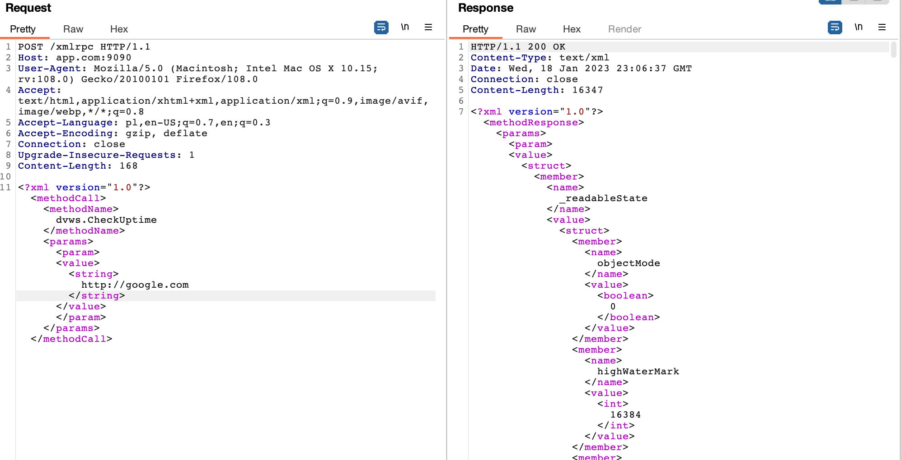

# Damn Vulnerable Web Services

## Aplikacja
Aplikacja Damn Vulnerable Web Services to podatna na ataki usługa internetowa i interfejs API, której można użyć do poznania luk w zabezpieczeniach związanych z usługami sieciowymi/API.
Instalacja aplikacji przebiega za pomocą dockera. Wystarczy wywołać polecenie:
```
`docker-compose up`
```
Na koniec nalezy w pliku /etc/hosts podmienić nazwę localhost dla adresu 127.0.0.1 na wybraną nazwę aplikacji.

Aplikacja webowa została napisana w JavaScript.

## WERSJE OPROGRAMOWANIA

Tested on:
* node v10.19.0
* npm 6.13.7
* mongodb 4.0.4


## TESTY ZABEZPIECZEŃ

1. Hashowanie haseł

    Hasła są zaszyfrowane
    

2. XML External Entity Injection (XXE)

    Jest to Wstrzyknięcie podmiotu zewnętrznego XML (znane również jako XXE) to luka w zabezpieczeniach sieci Web, która umożliwia osobie atakującej ingerowanie w przetwarzanie danych XML przez aplikację. Często umożliwia atakującemu przeglądanie plików w systemie plików serwera aplikacji i interakcję z dowolnymi systemami zaplecza lub systemami zewnętrznymi, do których sama aplikacja ma dostęp.
    Biblioteka XML używana przez serwer SOAP do analizowania tego żądania umożliwia korzystanie z jednostek zewnętrznych. W związku z tym można to wykorzystać do odczytu dowolnych plików z usługi SOAP.
   

3. Server Side Request Forgery (SSRF)

    

4. User Enumeration

* tworze uzytkownika
    
* sprawdzam jaka jest odpowiedź serwera gdy on istnieje
    


* sprawdzenie uzytkownika moze odbywac sie tez za pomoca xml
    

    mając taką odpowiedź, hacker moze teraz za pomocą techniki brute force sforsować hasło uytkownika

5. NoSQL Injection - pozyskanie danych za pomocą zapytania do bazy
    Dzięki temu mozna było pozyskać wszystkie dostępne notatki, nawet te, które nie są publiczne.
    

6. Insecure Direct Object Reference
    

7. Mass Assignment

Atak polega na przypisywaniu wartości zmiennej po stronie serwera.
Przykłądem jest tworzenie użytkownika bez uprawnień adminstratora. 
W tym przypadku defaultowy obiekt użytkownika zostaje utworzony ze zmienną admin=false.
Atak będzie polegał na narzuceniu zmiennej admin=true i jednoczesnym przejęciu uprawnień administratora.


8. XML Cross-Site Scripting (XSS)
    
    
    

9. Hidden API Functionality Exposure
    Po uruchomieniu swaggera widać rózne dostępne endpointy. Wpisując w przeglądarkę po kolei kazdy endpoint, sprawdzane jest, czy sa on zabezpieczone.

    


10. SQL Injection
Ataki SQL Injection są niestety bardzo powszechne, a wynika to z dwóch czynników:
znaczne rozpowszechnienie luk SQL Injection oraz atrakcyjność celu (tj. baza danych zazwyczaj zawiera wszystkie interesujące/krytyczne dane dla Twojej aplikacji). Wstrzyknięcia SQL są wprowadzane, gdy twórcy oprogramowania tworzą dynamiczne zapytania do bazy danych zbudowane z konkatenacji łańcuchów, które obejmują dane wejściowe wprowadzone przez użytkownika. Może to zostać wykorzystane do przeglądania, modyfikowania lub usuwania danych aplikacji, co wcześniej nie było możliwe, lub do powodowania trwałych zmian w zawartości lub zachowaniu aplikacji.

Uniknięcie błędów iniekcji SQL jest proste. Deweloperzy muszą albo: 
a) przestać pisać dynamiczne zapytania z konkatenacją łańcuchów;
i/lub
b) zapobiegać wpływaniu danych wejściowych użytkownika, które zawierają złośliwy kod SQL, na logikę wykonywanego zapytania.

Poniżej przeprowadzono atak polegający na wstrzyknięciu w URL dodatkowego znaku ' po nazwie użytkownika.
Przed atakiem:


Atak:


Po ataku:


Kolejny atak polegał na podmienieniu nazwy użytkownika na frazę '1'='1


11. Information Disclosure
* uzytkownikowi po zalogowaniu zwracane sa zszyfrowane haslo


12. Command Injection
    
    


13. JSON Hijacking

    Kradzież tych informacji jest możliwa z następujących powodów:

    Dane są zwracane z typem zawartości Content-Type: application/json (nie określono zestawu znaków)
    Dane są zwracane wewnątrz tablicy [].
    Do wykonania powyższego żądania nie jest wymagane żadne uwierzytelnienie (problem z kontrolą dostępu)
    Uwaga: w większości nowoczesnych przeglądarek usunięto problem przechwytywania JSON

    

14. XPath Injection ????

15. Cross Origin Resource Sharing Misonfiguration ???


16. JWT Secret Key Brute Force

    Uzytkownikowi po zalogowaniu zwracany jest token jwt. Token ten mozna sprobowac rozszywrowac uzywajac roznych narzedzi jak np. jwt-cracker.
    
    


15. Vertical Access Control

Pionowa eskalacja uprawnień jest możliwa, jeśli klucz kontrolowany przez użytkownika jest w rzeczywistości  flagą wskazującą status administratora, umożliwiając atakującemu uzyskanie dostępu administracyjnego.

Wiele wywołań interfejsu API, które może wykonać tylko administrator w obszarze administracyjnym, może wywołać użytkownik bez uprawnień administratora.

Po zalogowaniu na zwykłego użytkownika, wchodzimy w panel z danymi dla admina. Rozpoczyna się sprawdzanie uprawnień:


Atak polega na podmienieniu URL:


Użytkownik bez uprawnień administratora uzyskał dostęp do panelu admina:


Sprawdzenie możliwość korzystania z panelu i wyszukanie innego użytkownika:


16. Horizontal Access Control

Pozioma eskalacja uprawnień umożliwia jednemu użytkownikownikowi przeglądać/modyfikować informacje innego użytkownika.
Możliwe jest przeglądanie haseł utworzonych przez użytkownika, jeśli znasz nazwę użytkownika lub jego ID.

Utworzenie rekordu danych dla użytkownika z uprawnieniami administratora.


Zalogowanie na zwykłego użytkownika Marcin oraz podmiana nazwy użytkownika na tego z uprawnieniami administratora.


Dostęp do passphare administratora :


17. Path Traversal

Path Traversal umożliwia atakującym przechodzenie przez system plików w celu uzyskania dostępu do plików lub katalogów znajdujących się poza katalogiem objętym ograniczeniami.
W obszarze przechowywania można przesyłać pliki, które są przechowywane w lokalnym systemie plików, a następnie można je pobrać za pomocą funkcji pobierania.

Tym żądaniem HTTP można manipulować w celu odczytania dowolnych plików z systemu. Atak polega na podmianie nazwy i ścieżki pliku, który ma zostać pobrany.


# Podsumowanie
